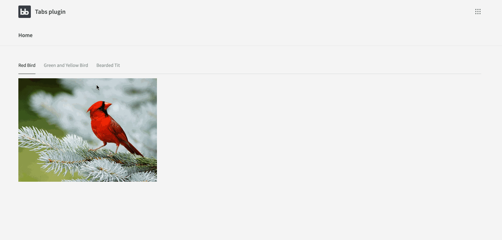
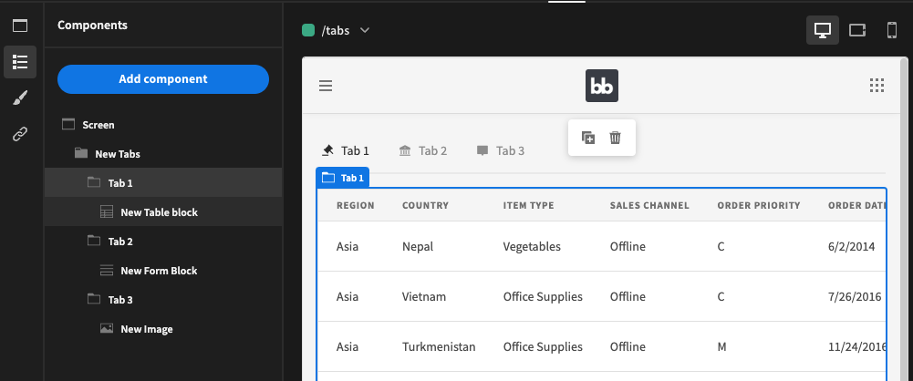

# Budibase Tab Container

This is the child component of a two part plugin. 
You will also need the parent [Tabs plugin](https://github.com/poirazis/bb-plugin-Tabs)

# Description

Adds support for tabs in Budibase!

## Instructions

1. [Import](https://docs.budibase.com/docs/custom-plugin) the Tab Container and Tabs plugins
2. Add the Tabs component, and nest your Tab Containers within
3. Give each of your Tab Containers a name and add any components you wish
4. Tab Containers can also be given an icon

